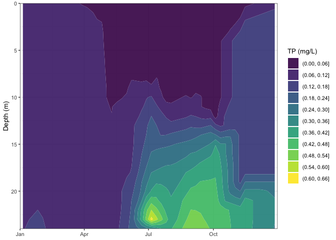

<!-- README.md is generated from README.Rmd. Please edit that file -->

## Why?

A better way of interpolating nutrient data in the lakes. Both for load
calculations and for data visualization.

We often linearly interpolate water quality observations between
observation depths. This is typically fine if a lake is well mixed, but
if it’s stratified it introduces a lot of error around the thermocline.
Here, I provide functions to interpolate water quality observations
leveraging information on lake stratification from temperature data.
Often there is more temperature data than water quality data, which
results in better interpolation.

## Installation

You can install NTLlakeloads from github using devtools:

``` r
install.packages("devtools")
devtools::install_github("hdugan/NTLlakeloads")
library(NTLlakeloads)
```

## Get LTER data

``` r
# Load NTL datasets
LTERtemp = loadLTERtemp() # Download NTL LTER data from EDI
LTERnutrients = loadLTERnutrients() # Download NTL LTER data from EDI
LTERions = loadLTERions() # Download NTL LTER data from EDI
LTERsecchi = loadLTERsecchi() # Download NTL LTER data from EDI
```

# Additionally, these datasets can be viewed at

# <https://github.com/hdugan/NTLviewer>

## Variables available for plotting

``` r
# Available variables
availableVars()

# Available variables that are not depth-discrete. Used with weeklyInterpolate.1D.
availableVars.1D()
```

## Interpolate weekly total phosphorus data for Lake Mendota

``` r
# printFigs = TRUE to output series of interpolated profiles (but slower)
# See help file for parameter descripts
df.ME = weeklyInterpolate(lakeAbr = 'ME', var = 'totpuf_sloh', dataset = LTERnutrients, maxdepth = 24, 
                          constrainMethod = 'zero', setThreshold = 0.1, printFigs = F)
```

## Plotting entire timeseries

``` r
plotTimeseries(df.interpolated = df.ME$weeklyInterpolated, var = 'totpuf_sloh')
```

<!-- --><!-- -->

## Plot specific year with observed data

``` r
# With observations
plotTimeseries.year(df.interpolated = df.ME$weeklyInterpolated, observations = df.ME$observations,  var = 'totpuf_sloh', chooseYear = 2008)
```

<!-- --><!-- -->

``` r
# Without observations, but adding legend title 
plotTimeseries.year(df.interpolated = df.ME$weeklyInterpolated, var = 'totpuf_sloh', chooseYear = 2008, legend.title = 'TP (µg/L)')
```

<!-- --><!-- -->

## Calculate load at annual or weekly timescales

``` r
df.load.annual = calcLoad(df.ME$weeklyInterpolated,lakeAbr = 'ME', time.res = 'annual', conversion = 1e6)
```

## Example of plotting annual load

``` r
library(ggplot2)

ggplot(df.load.annual, aes(x = year, y = load)) +
  geom_path() +
  geom_point() +
  ylab('TP (kg)') +
  labs(title = 'Lake Mendota annual TP load', caption = 'Calculated from NTLlakeloads') +  
  theme_bw(base_size = 10) +
  theme(axis.title.x = element_blank())
```

<!-- -->

## Decompose weekly load timeseries to analyse trends and seasonality

``` r
df.load = calcLoad(df.ME$weeklyInterpolated,lakeAbr = 'ME', time.res = 'weekly', conversion = 1e6)

decomposeTS(df.load, lakeAbr = 'ME', var = 'totpuf_sloh')
```

<!-- -->

    #> # A tibble: 4,904 × 3
    #>    date       decompose value
    #>    <date>     <fct>     <dbl>
    #>  1 1995-05-09 var.load   43.1
    #>  2 1995-05-09 var.trend  NA  
    #>  3 1995-05-09 var.seas  -13.2
    #>  4 1995-05-09 var.err    NA  
    #>  5 1995-05-16 var.load   44.0
    #>  6 1995-05-16 var.trend  NA  
    #>  7 1995-05-16 var.seas  -13.6
    #>  8 1995-05-16 var.err    NA  
    #>  9 1995-05-23 var.load   45.0
    #> 10 1995-05-23 var.trend  NA  
    #> # … with 4,894 more rows
