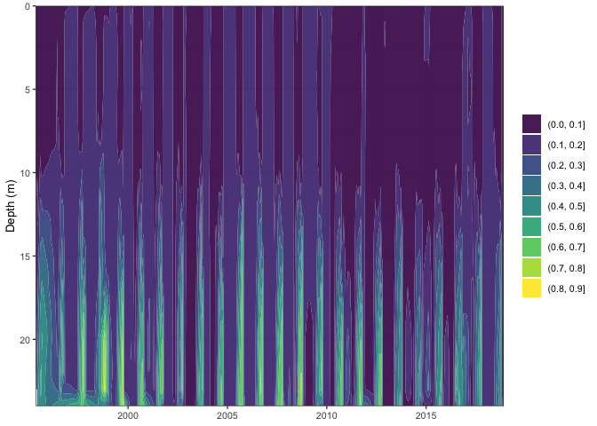
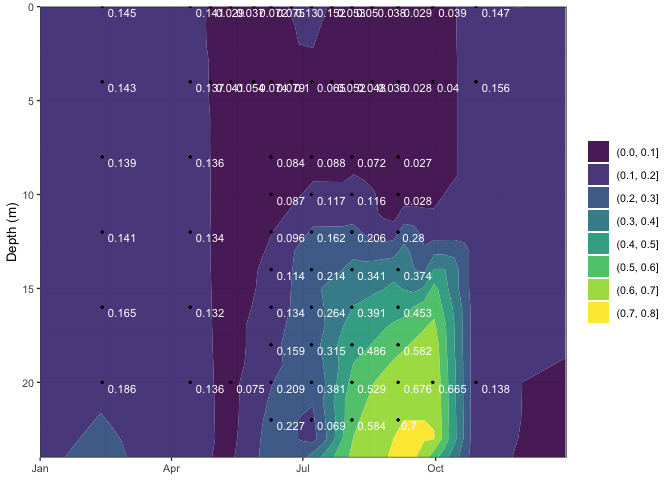

<!-- README.md is generated from README.Rmd. Please edit that file -->

## Why?

A better way of interpolating nutrient data in the lakes. Both for mass
calculations and for data visualization.

We often linearly interpolate water quality observations between
observation depths. This is typically fine if a lake is well mixed, but
if it’s stratified it introduces a lot of error around the thermocline.
Here, I provide functions to interpolate water quality observations
leveraging information on lake stratification from temperature data.
Often there is more temperature data than water quality data, which
results in better interpolation.

The functions in this package allow you to: \* Load NTL-LTER data from
EDI \* Interpolate water quality data to a weekly, 1-m interval,
dataframe \* Plot data \* Calculate weekly mass and mean annual mass

Why is it called lakeloads? Mass cacluations can be used to infer
loading.

## Installation

You can install NTLlakeloads from github using devtools:

``` r
install.packages("devtools")
devtools::install_github("hdugan/NTLlakeloads")
library(NTLlakeloads)
```

## Get LTER data

``` r
# Load NTL datasets
LTERtemp = loadLTERtemp() # Download NTL LTER data from EDI
LTERnutrients = loadLTERnutrients() # Download NTL LTER data from EDI
LTERions = loadLTERions() # Download NTL LTER data from EDI
LTERsecchi = loadLTERsecchi() # Download NTL LTER data from EDI
```

### Additionally, these datasets can be viewed at: <https://github.com/hdugan/NTLviewer>

## Variables available for plotting

``` r
# Available variables
availableVars()

# Available variables that are not depth-discrete. Used with weeklyInterpolate.1D.
availableVars.1D()
```

## Interpolate weekly total phosphorus data for Lake Mendota

``` r
# printFigs = TRUE to output series of interpolated profiles (but slower)
# See help file for parameter descriptions
# 
df.ME = weeklyInterpolate(lakeAbr = 'ME', var = 'totpuf_sloh', dataset = LTERnutrients, maxdepth = 24, 
                          constrainMethod = 'zero', setThreshold = 0.1, printFigs = F)
```

## Plotting entire timeseries

``` r
plotTimeseries(df.interpolated = df.ME$weeklyInterpolated, var = 'totpuf_sloh')
```

<!-- -->

## Plot specific year with observed data

``` r
# With observations
plotTimeseries.year(df.interpolated = df.ME$weeklyInterpolated, observations = df.ME$observations,  
                    var = 'totpuf_sloh', chooseYear = 2008)
```

<!-- -->

``` r

# Without observations, but adding legend title and decreasing binsize 
plotTimeseries.year(df.interpolated = df.ME$weeklyInterpolated, var = 'totpuf_sloh', binsize = 0.06,
                    chooseYear = 2016, legend.title = 'TP (mg/L)')
```

<!-- -->

## Customize plots

Since these functions return a ggplot, they can be additionally
customized with ggplot options. For example:

``` r
library(MetBrewer)
library(ggplot2)

plotTimeseries.year(df.interpolated = df.ME$weeklyInterpolated,
                    var = 'totpuf_sloh', chooseYear = 2015, binsize = 0.1, legend.title = 'TP (mg/L)') +
  scale_fill_manual(values=met.brewer("Hokusai2", 7)) + # override color default
  geom_point(data = df.ME$observations, aes(x = sampledate, y = depth), size = 1, fill = 'gold', 
             shape = 22, stroke = 0.2) + # sampling observations
  labs(title = 'Lake Mendota, total phosphorus 2015', x = 'Date') +
  theme_minimal(base_size = 10)
```

<!-- -->

## Calculate mass at annual or weekly timescales

``` r
# Conversion from g to kg
df.mass.annual = calcMass(df.ME$weeklyInterpolated,lakeAbr = 'ME', time.res = 'annual', conversion = 1e3)
```

## Example of plotting annual mass

``` r
library(ggplot2)

ggplot(df.mass.annual, aes(x = year, y = mass)) +
  geom_path() +
  geom_point() +
  ylab('TP (kg)') +
  labs(title = 'Lake Mendota mean annual TP mass', caption = 'Calculated from NTLlakeloads') +  
  theme_bw(base_size = 10) +
  theme(axis.title.x = element_blank())
```

<!-- -->

## Decompose weekly mass timeseries to analyse trends and seasonality

``` r
df.mass = calcMass(df.ME$weeklyInterpolated,lakeAbr = 'ME', time.res = 'weekly', conversion = 1e3)

decomposeTS(df.mass, lakeAbr = 'ME', var = 'totpuf_sloh')
```

<!-- -->

    #> # A tibble: 4,904 × 3
    #>    date       decompose   value
    #>    <date>     <fct>       <dbl>
    #>  1 1995-05-09 var.mass   43130.
    #>  2 1995-05-09 var.trend     NA 
    #>  3 1995-05-09 var.seas  -13151.
    #>  4 1995-05-09 var.err       NA 
    #>  5 1995-05-16 var.mass   43996.
    #>  6 1995-05-16 var.trend     NA 
    #>  7 1995-05-16 var.seas  -13643.
    #>  8 1995-05-16 var.err       NA 
    #>  9 1995-05-23 var.mass   44957.
    #> 10 1995-05-23 var.trend     NA 
    #> # … with 4,894 more rows
